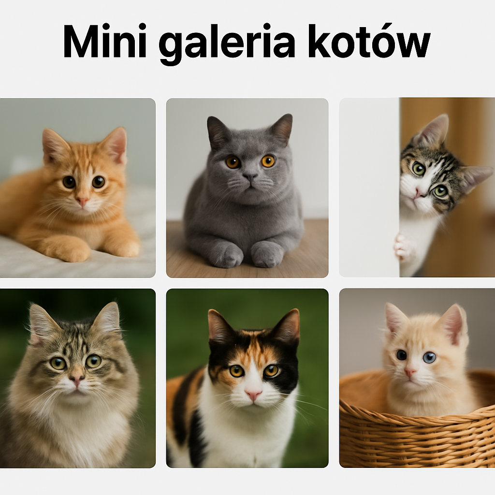

# 🐱 Mini galeria kotów

Minimalistyczna aplikacja webowa stworzona w React, która wyświetla 6 losowych zdjęć kotów. Użytkownik może powiększyć dowolne zdjęcie w modalu, a także odświeżyć galerię klikając „Refresh cats”.

🔗 **Zobacz na żywo:**  
👉 [https://damianar420.github.io/mini-galeria-kotow/](https://damianar420.github.io/mini-galeria-kotow/)

---

## ✨ Funkcje

- 🐾 Pobieranie 6 losowych zdjęć kotów
- 🔍 Powiększanie zdjęcia po kliknięciu (modal)
- 🔄 Przycisk „Refresh cats” do odświeżenia galerii
- 🌀 Loader podczas ładowania zdjęć
- 🎨 Prosty, responsywny design z użyciem Tailwind CSS
- ✨ Animacje fade-in zdjęć i modala

---

## 🛠️ Technologie

- React
- Tailwind CSS
- TheCatAPI
